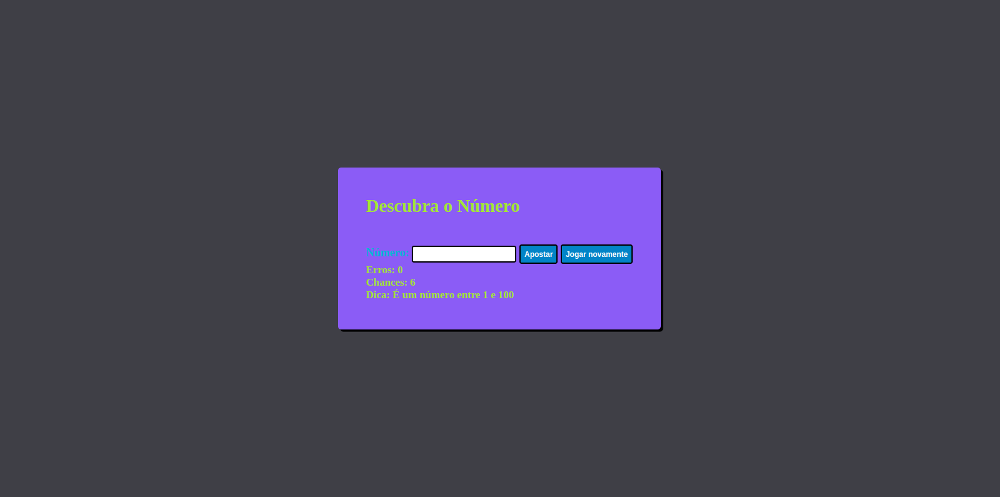
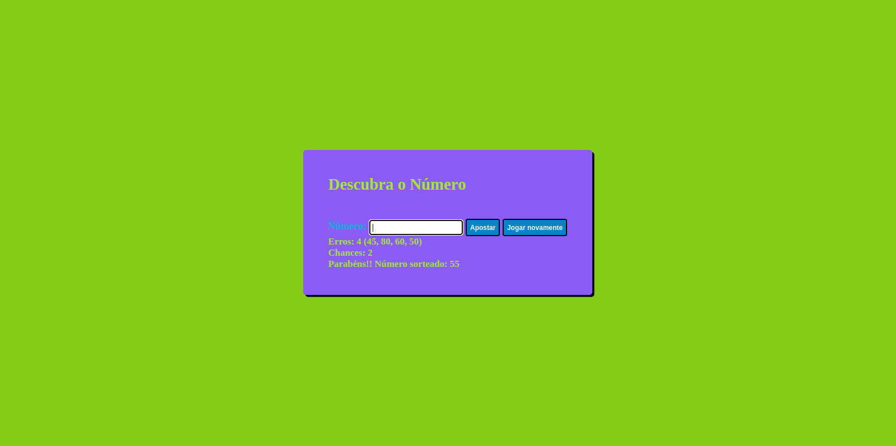

<h1 align="center"> Descubra o Número </h1>

 

<h3 align="center">Tela inicial</h3>

  

## 🚀 Tecnologias

Esse projeto foi desenvolvido com as seguintes tecnologias:

- HTML e CSS
- JavaScript

## 💻 Projeto

O **Descubra um Número** é um projeto que foi desenvolvido para treinar o uso do HTML, CSS e JavaScript. 

 
<h3 align="center">Vitoria</h3>

  

 
<h3 align="center">Vitoria</h3>

  

